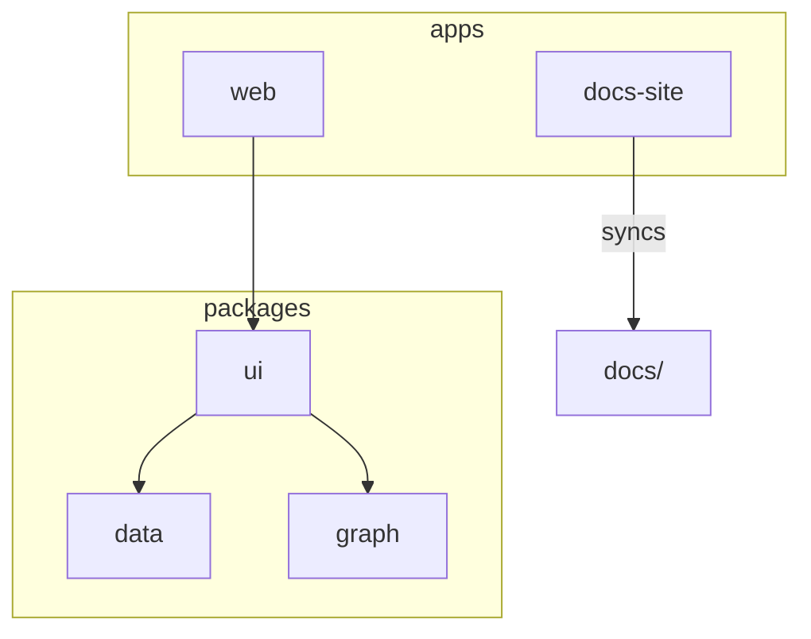

# Architecture

Knowledgable は monorepo 構成を採用し、アプリケーションと共通ライブラリを分割しています。本ドキュメントでは各パッケージが担う役割と理想的な振る舞いを説明します。

## 全体像



:::info
生成された知識グラフはブラウザ上で完結します。外部サーバーを必要とせず、すべてのデータはローカルストレージに保存されます。
:::

## packages/data

ドキュメント保存・検索を担当します。理想的には全文検索インデックスや履歴管理を備え、`Document` 型を通して安全に操作できるよう設計します。

```ts
import { saveDoc, getDocs } from '@kg/data';

saveDoc({ id: '1', content: 'Example', createdAt: Date.now() });
const docs = getDocs();
```

## packages/graph

知識グラフの生成ロジックと描画処理を提供します。`generateGraph` はテキスト解析結果からノードとエッジを生成し、`renderGraph` で Cytoscape.js を利用した可視化を行います。

## packages/ui

React コンポーネント群をまとめた UI 層です。`GraphViewer` を中心に、今後は編集フォームや検索バーなどを拡充します。

## apps/web

ユーザーインターフェース本体です。上述のパッケージを組み合わせ、Next.js でページ遷移や状態管理を行います。

## apps/docs-site

`docs/` 以下のMarkdown/MDXから静的サイトを生成します。構成方法は [getting started](../getting-started.md) を参照してください。

関連する API 一覧は [リファレンス](./index.md) で確認できます。
